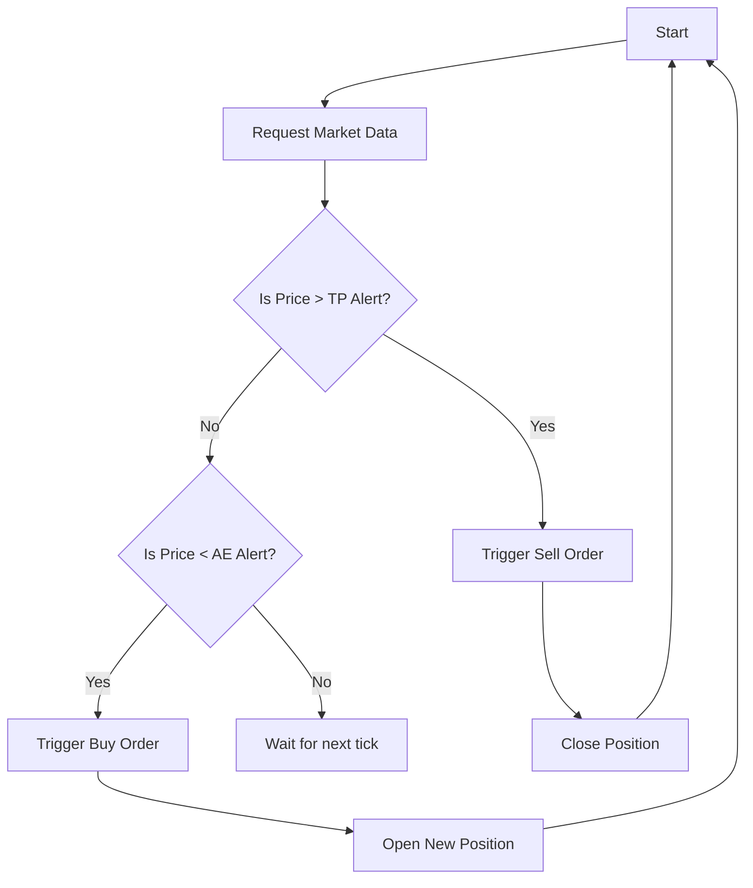

# Quantum-Enhanced Quantitative Trading Bot

## Introduction

This repository houses a sophisticated trading bot designed for the foreign exchange (FX) market, enhanced by cutting-edge quantum computing techniques. By blending traditional quantitative finance methods with quantum algorithms, this bot aims to optimize trading strategies, manage risks more effectively, and capture market opportunities with greater precision.

### Key Features:
- **Quantitative Finance Strategies:** Incorporates proven quantitative finance techniques such as mean reversion, momentum trading, and statistical arbitrage.
- **Quantum Monte Carlo Simulations:** Utilizes Quantum Monte Carlo methods to simulate and predict market movements with higher accuracy.
- **Quantum Annealing:** Optimizes trading parameters using quantum annealing to find the global optimum in complex financial landscapes.
- **Quantum Machine Learning (QML):** Analyzes large datasets with quantum-enhanced machine learning models to detect patterns and predict market trends.
- **Entanglement & Superposition:** Leverages quantum principles to manage multi-asset strategies, improving correlation and co-movement analyses between assets.

## Installation

Follow these steps to set up the trading bot on your local machine:

1. **Clone the Repository:**
   ```bash
   git clone https://github.com/yourusername/quantum-enhanced-trading-bot.git
   cd quantum-enhanced-trading-bot
   ```

2. **Install Dependencies:**
   ```bash
   pip install -r requirements.txt
   ```
   Ensure you have access to a quantum computing service such as IBM Qiskit or D-Wave.

3. **Set Up Environment Variables:**
   - **API_KEY:** Your broker's API key.
   - **QUANTUM_SERVICE_API:** API key for the quantum computing service.

4. **Run the Bot:**
   ```bash
   python trading_bot.py
   ```

## Usage

The bot can be used in various modes, including live trading, backtesting, and simulation:

### Live Trading
```bash
python trading_bot.py --mode live --symbol EURUSD
```

### Backtesting
```bash
python trading_bot.py --mode backtest --start 2023-01-01 --end 2023-12-31 --symbol EURUSD
```

### Simulation
```bash
python trading_bot.py --mode simulate --symbol EURUSD
```

## Quantum Techniques Applied

### Quantum Monte Carlo Simulations
Monte Carlo methods are enhanced using quantum algorithms to simulate the price paths of assets, incorporating stochastic processes. This technique improves the accuracy of predicting potential future prices and risks.

### Quantum Annealing
The bot uses quantum annealing to optimize the trading strategy parameters, finding the global optimum among a vast number of possible configurations. This ensures that the bot operates under the most favorable conditions for profitability.

### Quantum Machine Learning (QML)
QML models are implemented to analyze large datasets, providing deeper insights into market behaviors. These models are particularly effective in identifying non-linear patterns and correlations that traditional machine learning models might miss.

### Entanglement & Superposition
Quantum entanglement and superposition are used to manage multi-asset trading strategies, allowing the bot to capture the interdependencies between different assets. This results in a more cohesive and effective trading strategy.

## Algorithmic Strategy

The bot employs a sophisticated algorithm that combines traditional quantitative methods with quantum enhancements:

### Entry and Exit Strategy
- **Mean Reversion:** Buys assets when prices deviate significantly from their historical mean and sells when they revert.
- **Momentum Trading:** Capitalizes on the continuation of existing market trends.
- **Statistical Arbitrage:** Exploits price inefficiencies between related assets.

### Risk Management
- **Stop Loss:** Automatically exits trades when the market moves unfavorably.
- **Position Sizing:** Determines the size of each trade based on the bot's confidence level and risk appetite.

### Parameter Optimization
- **Quantum Annealing:** Continuously optimizes parameters such as the Take Profit Margin (TPM), Accepted Reversal Margin (ARM), and Bearish Entry Level (BEL).

### Example Trading Logic Flow


## Advanced Features

- **Real-Time Data Analysis:** The bot continuously analyzes live market data to make informed trading decisions.
- **Quantum-Enhanced Backtesting:** Leverages quantum algorithms to run backtests faster and more accurately.
- **Multi-Asset Management:** Handles portfolios with multiple assets, optimizing overall performance through quantum entanglement techniques.

## Contributing

We welcome contributions to improve the trading bot. Please adhere to the following guidelines:
- **Coding Standards:** Follow PEP8 for Python code.
- **Pull Requests:** Ensure your PRs are well-documented and tested.
- **Bug Reports:** Submit issues with a clear description and steps to reproduce.

## License

This project is licensed under the MIT License - see the [LICENSE](LICENSE) file for details.
